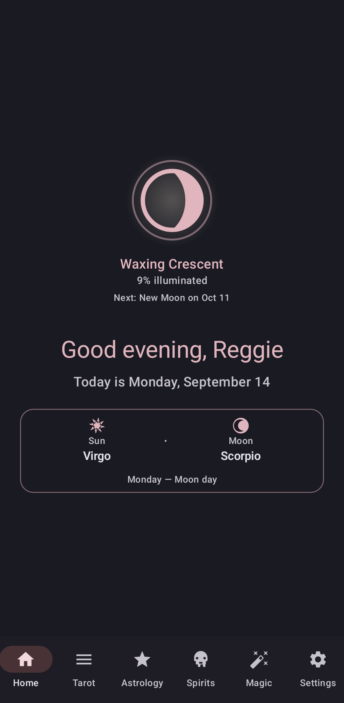
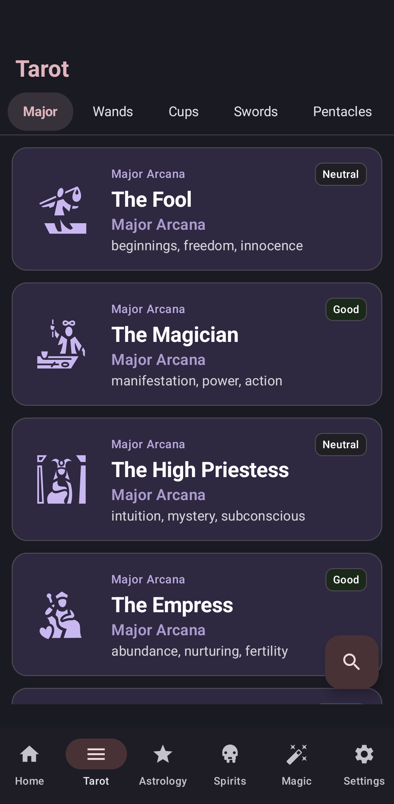
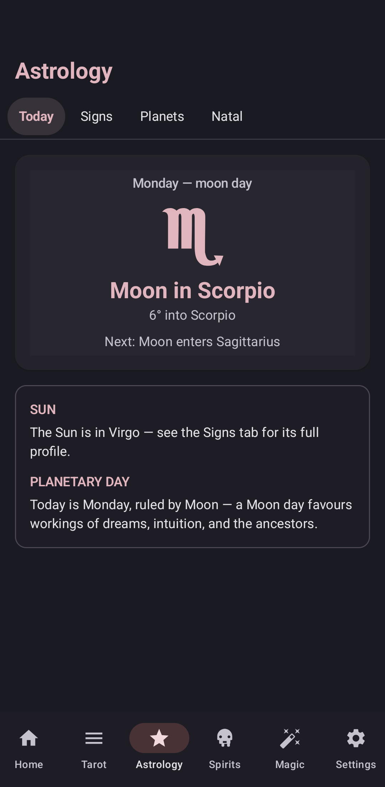
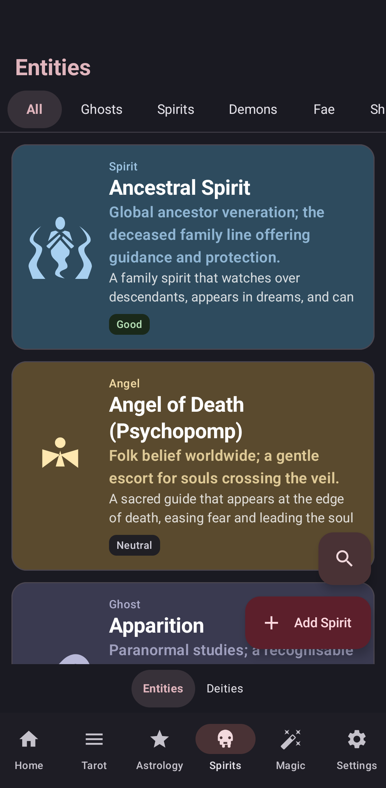
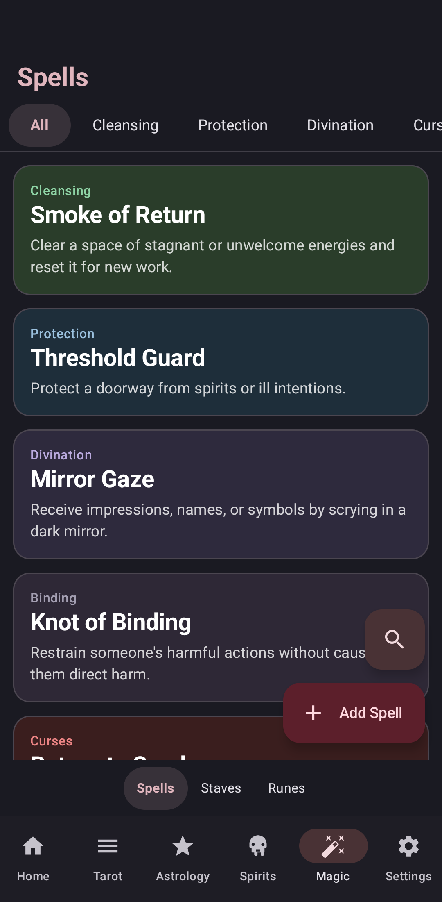

# Athenaeum

<p align="center">
  
</p>

<p align="center">
  
  
  
  
  
</p>

An occult companion app. A Rust core crate owns all data, logic, and storage; a thin Kotlin + Jetpack Compose UI sits on top and talks to it over JNI.

**Fully offline and local.** All data lives in a SQLite database on your device, owned entirely by the Rust core. No analytics, no tracking, no network calls. The only outbound links are Wikipedia articles and the Ko-fi page, opened in your browser.

## Features

- Browse all 78 tarot cards in a grid, with upright/reversed meanings, keywords, and contextual meanings by situation
- Daily astrology: planetary day, sun and moon signs, moon illumination, and next sign ingress
- Moon phase home screen widget and a lunar calendar dialog
- Natal charts: enter a birth profile (date, time, place) and get placements, retrogrades, houses, and aspects
- Spirits section: browsable entity and deity references with offerings, search, and Wikipedia links
- Magic section: spellbook, Icelandic magical staves, and the Elder Futhark runes with bindrune uses
- Everything is editable: rename, rewrite meanings, add your own entries, or delete builtins (and restore them later)
- Per-feature toggles in onboarding and settings, so you can hide what you don't use
- Wine-and-ink theme across all Material 3 color slots, with a Settings toggle for Material You wallpaper colors
- Full backup and restore as a single file
- Four Android ABIs: `arm64-v8a`, `armeabi-v7a`, `x86`, `x86_64`

## Architecture

- `core/` — Rust `cdylib` crate
  - `models.rs` — Card, Suit, Arcana, DrawnCard, Reading, Deity, Entity, Spell, Stave, Offering, BirthProfile, and friends
  - `deck.rs` — complete 78-card Rider-Waite-Smith deck
  - `database.rs` — SQLite schema, migrations, seeding of all builtin content
  - `astro.rs`, `astro_data.rs` — daily astrology: planetary day, moon sign and illumination, sign ingresses
  - `natal.rs` — natal chart math: placements, retrogrades, houses, aspects
  - `deities.rs`, `entities.rs`, `offerings.rs` — 205 deities, 39 entities, and their offerings
  - `spells.rs`, `staves.rs` — 32 spells and 26 Icelandic magical staves
  - `lib.rs` — query interface + JNI exports
- `app/` — Android app (Kotlin + Compose)
  - `TarotCore.kt` — JNI bridge returning typed JSON
  - `FeatureSettings.kt` — per-feature toggles (Tarot, Astrology, Magic, Spirits, and their sub-features)
  - `BackupManager.kt` — full backup/restore to a single `.terotbackup` file
  - `UserOverrides.kt` — local edits to card and rune meanings
  - `MoonWidgetProvider.kt` — moon phase home screen widget
  - `MainActivity.kt` — navigation and the wine/ink Material 3 theme
  - Compose screens: home with moon calendar, card grid and detail, readings, astrology, natal charts, spirits (entities + deities), magic (spells, staves, runes), settings
  - Onboarding flow with feature customization

## Build

Requirements: JDK 17, Android SDK with NDK 27.2.12479018, Rust with Android targets.

```bash
rustup target add \
  aarch64-linux-android \
  armv7-linux-androideabi \
  i686-linux-android \
  x86_64-linux-android
```

Set `ANDROID_HOME` and create `local.properties`:

```properties
sdk.dir=/path/to/android-sdk
ndk.dir=/path/to/android-sdk/ndk/27.2.12479018
```

Then:

```bash
./gradlew assembleDebug
```

The debug APK lands at `app/build/outputs/apk/debug/app-debug.apk`. The gradle plugin builds the Rust core for all four ABIs automatically; you do not need to invoke cargo yourself.

Release builds sign with `keystore.properties` at the repo root:

```properties
storeFile=/absolute/path/to/athenium-release.keystore
storePassword=...
keyAlias=...
keyPassword=...
```

Without that file, release builds are unsigned (and `installRelease` is skipped).

## Test the Rust core

`cargo test` runs without Android:

```bash
cd core
cargo test
```

## Install on device

```bash
./gradlew installDebug
```

## Download

Grab `app-release.apk` from the [releases page](https://github.com/zad1ag/athenaeum/releases) and sideload it. Requires Android 8.0+.

## Credits

- [game-icons.net](https://game-icons.net) — entity and spell icons, licensed [CC BY 3.0](https://creativecommons.org/licenses/by/3.0/)

## License

This program is free software: you can redistribute it and/or modify it under the terms of the GNU General Public License as published by the Free Software Foundation, either version 3 of the License, or (at your option) any later version.

See [LICENSE](./LICENSE) for the full license text.

Because this is GPL-3.0, anyone distributing modified versions must release their source under the same license. Closed-source forks are not permitted.

The GPL doesn't require visible attribution, but it's asked for: if you fork this or build on it, a link back to [this repo](https://github.com/zad1ag/athenaeum) somewhere in your README or about page is appreciated.
